# Revised Implementation Plan — From Pipeline Validation to Realistic Visual Interception

> **Project**: RL-Based Image-Guided High-Speed Drone Interception via IBVS  
> **Reference**: Yang, Bai, She, Quan — arXiv:2404.08296  
> **Last updated**: 2026-05-27  

## Progress Snapshot

- [x] **Stage 1a** — Pipeline validation (kinematic + full obs)
- [x] **Stage 1b** — Action smoothing, acceleration commands, prev-action in obs
- [x] **Stage 2a** — Vision-only obs (ground-truth distance/LOS/relative-vel removed)
- [x] **Stage 2b** — Noise + delay wrapper + DKF observer (wrappers wired in `train.py`)
- [ ] **Stage 3a-v1** — ❌ Attempted (15M steps), failed: 2% deterministic success, 50% FOV loss, 48% timeout. Reward hacking + bang-bang yaw + infeasible braking. See "Lessons from Stage 3a v1" below.
- [x] **Stage 3a-v2** — Clean obs, no sensor noise. 46% deterministic success (15M, kinematic).
- [x] **Stage 3a-noisy** — 2b's noise+delay+DKF on top of 3a-v2. Mild noise (δ=1, σ=0.015): 66% with IMU DKF (kinematic). Full noise: 0% (DKF saturation, kinematic).
- [x] **Stage 3b** — 6-DOF Newton-Euler dynamics + SO(3) PD attitude controller. Clean: 96% (7M ckpt). Noisy-mild + IMU DKF: 96.5% (4M ckpt, 200 ep seed=1000). Noisy-full: ~2% (perception ceiling, unchanged by dynamics upgrade).
- [x] **Stage 4a — CBF safety filter, completed.**
  - **4a.1 — bisection bolt-on** (no retrain): 84.0% / 16.0% FOV / 0 attitude violations. Action-magnitude bisection over a 6-DOF rollout horizon. Robust but heavily over-corrective (79% of steps, avg norm 0.55).
  - **4a.2 — bisection co-trained** (3M fine-tune + linear LR decay): 85.5% / 14.5% / 0 viol (2M ckpt). +1.5pp over bolt-on. Bisection can only *scale* actions, so the policy can't escape the throttle.
  - **4a.3 — proper HOCBF** (analytical Lie derivatives via proxy control-affine linearization + quadprog QP + inner safety margin): **89.0% / 11.0% FOV / ~0% actual attitude exceedance** (max|pitch|=0.563, max|roll|=0.616 over by 0.005 rad on 0.1% of steps), at correction rate 55% / avg norm 0.36 — substantially less invasive than bisection. Co-training with HOCBF gave 88.5% (2.8M ckpt), did not beat bolt-on. **Locked: existing 3b-noisy-mild 4M ckpt + HOCBF wrapper at alpha=100, margin=0.10.**
  - The 7.5pp cost vs 96.5% no-CBF baseline is the inherent price of guaranteed pitch/roll safety on this dynamics + action space.
- [ ] Stage 4b — future

> **Decision (2026-05-27): Option B — decouple stages.** Stage 3a was originally specified as "inertia *on top of* 2b's noise/delay/DKF" but was implemented and trained on clean observations. Rather than re-add sensor noise concurrently with the 3a fixes (which violates the plan's "one change per stage" principle), we explicitly split 3a into a clean-obs sub-stage (`3a-v2`) and a noisy sub-stage (`3a-noisy`).

---

## Current State and Lessons Learned

### What we have built (Stage 1a — COMPLETE)

A fully working Gymnasium + Stable-Baselines3 PPO pipeline with:
- Kinematic interceptor model (instant velocity commands, yaw-only heading)
- Point-mass target with 4 maneuver modes
- Pinhole camera projection with FOV constraints
- 18-dimensional observation vector (includes ground-truth distance, velocity, LOS)
- 4-dimensional action space (body-frame velocities + yaw rate)
- 7-component reward function
- Vectorized training, TensorBoard logging, evaluation, and animated visualization

### Training results
- **100% success rate** after ~1M timesteps (converged by ~500K)
- **0% FOV loss** and **0% timeout**
- Mean image error ~0.67 (high — agent doesn't center the target)

### Problems identified

| Problem | Root Cause | Evidence |
|---|---|---|
| **Zigzag trajectory** | No inertia — velocity reverses instantly every 0.02s | Action plot shows v_y, v_z slamming ±1 at every timestep |
| **Agent doesn't do visual servoing** | Ground-truth distance and velocity given in observation — agent solves a 3D pursuit problem, not a 2D image-based one | Image error stays high (~0.67) even at 100% success |
| **Reward hacking (earlier)** | Initial reward weights made hovering more rewarding than intercepting | Fixed by retuning, but reveals fragility |
| **Unrealistic speed advantage** | Interceptor v_max=15 m/s vs target v_max=10 m/s with zero dynamics lag | Problem is trivially solvable — just fly faster than the target |

### Key insight

> The current agent has learned to solve a **3D pursuit problem with perfect information**, not a **2D visual servoing problem with partial observability**. Every subsequent stage must strip away one "cheat" and force the agent to develop more sophisticated strategies.

---

## Revised Stage Architecture

The overall pipeline we are building toward:

```
Delayed Noisy Image → DKF Observer → RL Guidance Policy → CBF-HardNet Safety Filter → 6-DOF Controller → Multicopter
```

We will build this incrementally. **Each stage introduces exactly ONE new challenge.** This is critical — if training fails after a change, we know precisely what caused it.

```mermaid
graph LR
    A["Stage 1a ✅<br/>Kinematic + Full Obs"] --> B["Stage 1b ✅<br/>+ Action Smoothing"]
    B --> C["Stage 2a ✅<br/>− Ground Truth Obs"]
    C --> D["Stage 2b ✅<br/>+ Noise & Delay + DKF"]
    D --> E1["Stage 3a-v1 ❌<br/>Inertia (clean obs)<br/>2% success — failed"]
    E1 --> E2["Stage 3a-v2 ⏳<br/>Inertia + reward fix<br/>+ yaw lag (clean obs)"]
    E2 --> E3["Stage 3a-noisy<br/>+ Re-add 2b's noise/delay/DKF"]
    E3 --> F["Stage 3b<br/>+ Full 6-DOF Dynamics"]
    F --> G["Stage 4a<br/>+ CBF-HardNet Safety"]
    G --> H["Stage 4b<br/>+ Realistic Perception"]
```



---

## Stage 1b: Action Smoothing and Realistic Control Constraints ✅

### Goal
Eliminate the zigzag behavior by making the agent's actions physically plausible, while keeping the kinematic model.

### What changes

| Aspect | Stage 1a (current) | Stage 1b |
|---|---|---|
| Action semantics | Velocity command (instant response) | **Acceleration command** (velocity integrates over time) |
| Action rate | Can reverse ±1 every step | **Rate-limited** — `|a_t - a_{t-1}| ≤ Δa_max` |
| Effort penalty | `w_effort = -0.01` (negligible) | **`w_effort = -0.05`**, plus new **jerk penalty** `w_jerk = -0.1` |
| Observation | 18-dim | 18-dim + **previous action** (4-dim) → **22-dim** |

### Technical details

**Velocity integration model** (replaces instant velocity):
```
v_body(t+1) = clip(v_body(t) + a_cmd * dt, -v_max, v_max)
```

The agent commands acceleration `a_cmd ∈ [-a_max, a_max]` instead of velocity directly. This means:
- To reach v_max from rest, it takes `v_max / a_max` seconds (not 1 timestep)
- Reversing direction requires decelerating to zero first
- Zigzag becomes physically costly

**New reward terms**:
```
r_jerk = -w_jerk * ||a_t - a_{t-1}||²    (penalizes rapid action changes)
r_effort = -w_effort * ||a_t||²           (increased from -0.01 to -0.05)
```

### Files to modify

| File | Change |
|---|---|
| [drone_dynamics.py](file:///Users/eren/MacbookAir/GIT/Image_based_Visual_Servoing_RL/models/drone_dynamics.py) | Replace `self.velocity = R_be @ v_cmd_body` with acceleration integration |
| [interception_env.py](file:///Users/eren/MacbookAir/GIT/Image_based_Visual_Servoing_RL/envs/interception_env.py) | Add previous action to observation, add jerk penalty to reward |
| [config.yaml](file:///Users/eren/MacbookAir/GIT/Image_based_Visual_Servoing_RL/config.yaml) | Add `a_max`, `w_jerk`, update `w_effort`, add `action_rate_limit` |

### Training strategy
- **Fresh training** (do NOT warm-start from Stage 1a — the zigzag policy is harmful)
- Start with `a_max = 10 m/s²` (generous but not instant)
- Train for 3-5M timesteps (harder problem, needs more time)

### Success criterion
- Success rate > 90%
- 3D trajectory shows **smooth curves**, no zigzag
- Action plot shows gradual transitions, not bang-bang oscillations

---

## Stage 2a: Vision-Only Observation (Remove Ground-Truth Cheats) ✅

### Goal
Force the agent to solve the actual visual servoing problem by removing ground-truth 3D information from the observation.

### What changes

| Observation dim | Stage 1b (22-dim) | Stage 2a |
|---|---|---|
| `obs[0:2]` | Image-plane error (p̄_x, p̄_y) | ✅ **Keep** |
| `obs[2:4]` | Image-plane velocity (dp̄/dt) | ✅ **Keep** |
| `obs[4]` | FOV flag (in_fov) | ✅ **Keep** |
| `obs[5]` | **Normalized distance** (ground truth) | ❌ **REMOVE** |
| `obs[6:9]` | Body velocity (from dynamics) | ✅ **Keep** (agent knows its own velocity) |
| `obs[9:12]` | Euler angles | ✅ **Keep** (from IMU) |
| `obs[12:15]` | **LOS unit vector** (ground truth) | ❌ **REMOVE** (redundant with image coords) |
| `obs[15:18]` | **Relative velocity** (ground truth) | ❌ **REMOVE** |
| `obs[18:22]` | Previous action | ✅ **Keep** |

**New observation vector (13-dim)**:
```
o_t = [p̄_x, p̄_y, dp̄_x/dt, dp̄_y/dt, in_fov, v_body_x, v_body_y, v_body_z, roll, pitch, yaw, a_prev(4-dim)]
```

> [!IMPORTANT]
> **This is the hardest single transition in the entire plan.** The agent loses knowledge of how far away the target is and how fast it's moving relative to itself. It must now infer approach behavior purely from how the target moves on the image plane (e.g., image expansion = getting closer).

### Reward function change

> [!WARNING]
> The approach reward `r_approach = -Δd` uses ground-truth distance. We have two options:

**Option A (Recommended)**: Keep ground-truth distance **in the reward only** (not in the observation). This is standard practice in RL — the reward can use privileged information during training. The agent learns to approach without seeing the distance, but gets rewarded for closing it.

**Option B**: Replace the approach reward with an image-based proxy:
```
r_approach_image = w_expand * Δ(1/depth_estimate)   # image expansion rate
```
This is purer but much harder to tune and may not converge.

### Training strategy
- **Fresh training** (the old policy relied on obs[5] distance — it won't transfer)
- May need **curriculum learning**: start with target at 5-10m, gradually increase to 10-30m
- Train for 5-10M timesteps
- Consider using **LSTM or frame-stacking** instead of MLP, since the agent now needs temporal context to infer depth from image motion

### Success criterion
- Success rate > 70% (expect significant drop from 100%)
- Agent develops a clear "approach and center" strategy visible in trajectories
- Image error should be LOWER than Stage 1 (agent must center target to track it)

---

## Stage 2b: Measurement Noise, Delay, and DKF State Observer ✅

### Goal
Add realistic sensor imperfections and a Disturbance Kalman Filter to handle them.

### What changes

**Measurement model with delay and noise**:
```
z_k = [p̄_{k-D,x}, p̄_{k-D,y}]ᵀ + n_img    where n_img ~ N(0, σ²_img I)
```
- `D = 2-5` steps of delay (40-100ms at 50Hz — realistic camera processing latency)
- `σ_img = 0.01-0.05` (pixel noise in normalized coordinates)

**DKF state vector** (constant-velocity image-plane model):
```
x_k = [p̄_x, p̄_y, dp̄_x/dt, dp̄_y/dt]ᵀ
```

**DKF prediction model**:
```
x_{k+1} = F x_k + w_k
F = [[1, 0, Δt, 0],
     [0, 1, 0,  Δt],
     [0, 0, 1,  0 ],
     [0, 0, 0,  1 ]]
```

**DKF delayed measurement update**:
```
z_k = H x_{k-D} + n_k
H = [[1, 0, 0, 0],
     [0, 1, 0, 0]]
```

The DKF runs as a wrapper around the environment. The agent receives the **DKF's filtered estimate** instead of raw (delayed, noisy) measurements.

### Key comparison experiment
```
                                  Success Rate    Mean Image Error
Stage 2a (no noise, no delay)         X%              Y
Stage 2b (noise+delay, NO DKF)        ?               ?          ← expect large drop
Stage 2b (noise+delay, WITH DKF)      ?               ?          ← expect recovery
```

### Files to add/modify

| File | Change |
|---|---|
| **[NEW]** `observers/dkf.py` | Implement the Disturbance Kalman Filter |
| **[NEW]** `envs/wrappers/noise_delay_wrapper.py` | Gymnasium wrapper that adds noise and delay to observations |
| **[NEW]** `envs/wrappers/dkf_wrapper.py` | Gymnasium wrapper that filters observations through the DKF |
| [interception_env.py](file:///Users/eren/MacbookAir/GIT/Image_based_Visual_Servoing_RL/envs/interception_env.py) | No changes — wrappers handle everything |

### Training strategy
- **Warm-start from Stage 2a policy** (the observation structure is identical — DKF outputs the same 4 values the agent already expects)
- Fine-tune for 2-3M timesteps
- Train separately with and without DKF for comparison

### Success criterion
- With DKF: success rate within 10% of Stage 2a (noise-free) performance
- Without DKF: measurable degradation (proves DKF adds value)
- DKF estimation error (compared to ground truth) should be small

---

## Stage 3a-v1: Simplified Dynamics with Inertia — ATTEMPTED, FAILED ❌

### Goal (as designed)
Introduce physical realism into the drone's motion without the full complexity of 6-DOF dynamics — the drone has mass and cannot change velocity instantaneously, and camera pointing couples to attitude.

### What was implemented
- First-order velocity response: `v̇_body = (1/τ)(v_cmd - v_body)` with τ=0.20s
- Pitch/roll derived from commanded acceleration: `pitch = -arctan(a_x/g)`, `roll = arctan(a_y/g)`, clamped to ±35°
- Camera coupling: pitched body rotates the camera frame, target shifts on image plane
- Obs upgraded to 16-dim with normalized pitch/roll
- `w_attitude = -0.1` penalty on tilt magnitude
- Trained fresh for 15M timesteps on clean observations (no noise/delay/DKF wrappers attached)

### Observed outcome (50-episode deterministic eval)
| Metric | Result | Plan target |
|---|---|---|
| Success rate (deterministic) | **2% (1/50)** | >50% |
| FOV-loss rate | 50% | low |
| Timeout rate | 48% | low |
| Mean image error | 0.16 | low |
| TensorBoard `success_rate` during training | ~30% | — |

The 15× gap between in-training stochastic `success_rate` (~30%) and deterministic eval (2%) showed the policy was riding exploration noise, not converged.

### Lessons from Stage 3a v1

1. **Reward hacking dominated learning.** `w_image=1.0` paid up to +1.0/step for keeping the target framed. `w_approach=0.6` × typical Δd ≈ ±0.1m gave ≤±0.06/step. The optimal policy under those weights was *fly past the target and orbit at roughly constant distance* — tracking reward harvested indefinitely, Δd averaging to zero. Half the timeouts ended at <0.1 image error and 30–60m distance, confirming this.
2. **Bang-bang yaw came back.** Stage 1b's smoothing applied to translational velocity (via τ) but **not to the yaw rate command**. `self.yaw += yaw_rate * dt` with no lag meant the policy could flip yaw_rate ±1 every step at zero physical cost, producing the high-frequency oscillation visible in action plots.
3. **The success radius was physically infeasible.** With v_max=15 m/s and τ=0.20s, the minimum braking distance is ≈ v_max · τ = 3.0m. `d_success=0.5m` was unreachable from anywhere near max speed — no policy could succeed without first slowing to <2.5 m/s, which the reward structure did not encourage.
4. **Sensor noise/delay was silently dropped.** The plan specified 3a as "inertia on top of 2b's noise+delay+DKF," but `train.py --stage stage3a` was launched without `--noise-delay --dkf`. The DKF wrappers in `train.py:144-164` only attach when those CLI flags are present.
5. **Training metrics lied.** `InterceptionMetricsCallback` logs *stochastic-policy* rollouts. Without periodic deterministic eval, an over-confident TensorBoard curve masked the real failure for 15M steps.

---

## Stage 3a-v2: Inertia + Fixed Reward + Yaw Lag (NEXT) ⏳

### Goal
Re-train Stage 3a on **clean observations** with the v1 root-cause fixes applied, isolating inertia + attitude-camera coupling as the only new challenge. Defer sensor noise to `3a-noisy`.

### Changes applied (2026-05-27)

| Component | v1 | v2 | Rationale |
|---|---|---|---|
| `interceptor.tau_velocity` | 0.20 s | **0.15 s** | Reduces v_max braking distance from 3.0 m → 2.25 m |
| `interceptor.tau_yaw_rate` | — (none) | **0.10 s** (new) | Closes the bang-bang yaw loophole |
| `env.d_success` | 0.5 m | **2.0 m** | Physically achievable; realistic miss distance for drone-vs-drone visual interception |
| `reward.w_image` | 1.0 | **0.4** | De-emphasize pure tracking |
| `reward.w_approach` | 0.6 | **2.0** | Make closure progress dominate |
| `reward.w_dist_penalty` | — | **−0.02** (new) | Per-step penalty `∝ (d / norm_d_max)`. Closes the orbit-at-constant-distance loophole. |

All other 3a-v1 design choices (acceleration commands, pitch/roll coupling, `w_attitude=-0.1`, attitude in obs) are preserved.

### Files modified for v2
| File | Change |
|---|---|
| [config.yaml](config.yaml) | `tau_velocity`, new `tau_yaw_rate`, `d_success`, reward block (`w_image`, `w_approach`, new `w_dist_penalty`) |
| [models/drone_dynamics.py](models/drone_dynamics.py) | New `_yaw_rate` state + first-order lag in `step()` |
| [envs/interception_env.py](envs/interception_env.py) | Read `w_dist_penalty` from config; new reward term in `_compute_reward()` |

### Training strategy
- **Fresh training** — v1 policy is harmful, do not warm-start.
- Train for 10–20M timesteps. Re-evaluate every 2M steps with `python eval.py --stage stage3a` (deterministic, 50 episodes) — do **not** trust in-training stochastic success rate alone.
- If success rate plateaus <30% by 6M steps, stop and re-diagnose before burning more compute.

### Success criterion (v2)
- Deterministic success rate ≥ 40% on 50 eval episodes (relaxed from the original 50% — the harder dynamics + decoupling justify a softer gate)
- FOV-loss rate < 20%
- Trajectories show smooth approach and braking, no bang-bang yaw
- Mean cumulative reward correlates positively with success (sanity check that the reward function is well-formed)

### Stop conditions (when to revise weights, not just train longer)
- Reward goes up but success rate doesn't → reward is still misaligned
- FOV-loss > 30% sustained → `w_attitude` or `w_fov_loss` needs to be stronger, or `tau_velocity` is still too aggressive
- Many small-distance FOV losses (<5m) → terminal approach is too hot; consider an extra "near-target" velocity penalty

---

## Stage 3a-noisy: Re-add 2b's Noise + Delay + DKF on top of 3a-v2

### Goal
Restore the sensor degradation that 3a-v1 silently dropped, on a working inertial policy. This is the actual `inertia + noisy obs` combined challenge the original plan intended.

### What changes
- Same env, dynamics, and reward as 3a-v2
- Launch with `python train.py --stage stage3a_noisy --noise-delay --dkf` (uses [envs/wrappers/noise_delay_wrapper.py](envs/wrappers/noise_delay_wrapper.py) and [envs/wrappers/dkf_wrapper.py](envs/wrappers/dkf_wrapper.py))

### Training strategy
- **Warm-start from 3a-v2** (observation structure is preserved; DKF outputs replace obs[0:4] in place)
- Fine-tune 2–5M timesteps
- Three-way comparison: 3a-v2 (clean) vs noisy-without-DKF vs noisy-with-DKF — same comparison the plan called for under the original 2b but on the harder dynamics

### Success criterion
- With DKF: deterministic success rate within 10% of 3a-v2 clean baseline
- Without DKF: measurable degradation (confirms DKF carries its weight under inertial dynamics)

---

## Stage 3b: Full 6-DOF Multicopter Dynamics

### Goal
Replace the simplified dynamics with the complete Newton-Euler equations of motion for a multicopter.

### What changes

**Full 6-DOF state**:
```
State = [p(3), v(3), R(9 or quaternion 4), ω(3)]     (15-dim or 13-dim)
```

**Equations of motion** (from the paper, Eq. 1):
```
ṗ = v
v̇ = g + (1/m)(f + f_drag)
Ṙ = R [ω]×
J ω̇ = -ω × (Jω) + G_a + τ
```

**Action space changes**:
The RL agent no longer commands velocities. Instead:

| Option | Action | Low-level controller |
|---|---|---|
| **A (Recommended)** | Desired acceleration vector (3D) + desired yaw rate | PD attitude controller converts to motor thrusts |
| B | Desired attitude (roll, pitch, yaw) + collective thrust | Direct motor mixing |

Option A is recommended because it provides a natural interface — the RL agent thinks in terms of "where do I want to accelerate" and a well-tuned inner-loop controller handles the attitude tracking.

### Architecture

```
RL Policy → [a_des(3), ψ̇_des] → Attitude Controller → [τ(3), T] → Motor Mixing → [ω₁², ω₂², ω₃², ω₄²]
```

### Files to add/modify

| File | Change |
|---|---|
| **[NEW]** `models/multicopter_6dof.py` | Full 6-DOF dynamics, motor model, drag model |
| **[NEW]** `models/attitude_controller.py` | PD attitude controller (inner loop) |
| [config.yaml](file:///Users/eren/MacbookAir/GIT/Image_based_Visual_Servoing_RL/config.yaml) | Add mass, inertia matrix, motor params, drag coefficients |
| [interception_env.py](file:///Users/eren/MacbookAir/GIT/Image_based_Visual_Servoing_RL/envs/interception_env.py) | Replace InterceptorDrone with Multicopter6DOF + AttitudeController |

### Training strategy
- **Warm-start from Stage 3a** (the observation and action semantics are similar — both command accelerations)
- Inner-loop attitude controller must be **well-tuned before RL training begins** (test it with step responses)
- Train for 20-50M timesteps
- Consider domain randomization on mass and inertia

### Success criterion
- Success rate > 40% (very challenging)
- Agent learns to balance aggressive pursuit with camera stability
- Pitch oscillations should be bounded (not spinning out of control)

---

## Stage 4a: CBF-HardNet Safety Filtering

### Goal
Add a safety layer that modifies the RL policy's actions to guarantee field-of-view preservation, attitude limits, and actuator constraints.

### Safety constraints (CBF functions)

1. **Horizontal FOV preservation**:
```
h_hfov(x) = α_hfov/2 - |arctan(x_c / z_c)|  > 0
```

2. **Vertical FOV preservation**:
```
h_vfov(x) = α_vfov/2 - |arctan(y_c / z_c)|  > 0
```

3. **Maximum pitch angle**:
```
h_pitch(x) = θ_max - |θ|  > 0     (e.g., θ_max = 45°)
```

4. **Maximum roll angle**:
```
h_roll(x) = φ_max - |φ|  > 0      (e.g., φ_max = 45°)
```

### CBF-QP formulation
```
u_safe = argmin_u ||u - u_RL||²
subject to: ḣ_i(x, u) + α_i h_i(x) ≥ 0    for all i
```

### HardNet (learned safety filter)
Instead of solving the QP online (which can be slow and requires an analytical model), HardNet is a neural network trained to approximate the QP solution:

```
u_safe = H_ψ(x̂, u_RL)
```

**HardNet training procedure**:
1. Run the trained RL policy from Stage 3b to collect trajectories
2. At each state-action pair, solve the CBF-QP to get the ground-truth safe action
3. Train HardNet supervised: minimize `||H_ψ(x, u_RL) - u_QP*||²`
4. Fine-tune the RL policy with HardNet in the loop

### Files to add

| File | Change |
|---|---|
| **[NEW]** `safety/cbf_constraints.py` | Define h_i(x) functions and their gradients |
| **[NEW]** `safety/cbf_qp_solver.py` | QP solver for ground-truth safe actions |
| **[NEW]** `safety/hardnet.py` | Neural network safety filter |
| **[NEW]** `safety/hardnet_trainer.py` | Supervised training script for HardNet |

### Training strategy
1. First train the CBF-QP solver (no learning — just optimization)
2. Collect a dataset of (x, u_RL, u_QP*) tuples (~100K samples)
3. Train HardNet supervised on this dataset
4. Fine-tune the RL policy with HardNet in the loop for 5-10M steps

### Success criterion
- Safety violation rate < 1% (FOV loss events)
- Success rate within 15% of Stage 3b (safety filter may reduce aggressiveness)
- HardNet inference time < 1ms per step

---

## Stage 4b: Realistic Perception and Environmental Disturbances

### Goal
Replace the perfect point-target detection with noisy, intermittent visual detection and add environmental disturbances.

### What changes

**Noisy detector output**:
```
z_k = [ū_k, v̄_k, w_box, h_box]ᵀ + n_det     with probability p_detect
z_k = ∅                                         with probability (1 - p_detect)
```

**Detection probability model** (decreases with distance and angle):
```
p_detect = sigmoid(β₁ / d_rel - β₂ * θ_off_axis - β₃)
```

**Wind disturbance model**:
```
v̇ = g + (1/m)(f + f_drag + f_wind)
f_wind = Dryden turbulence model or Ornstein-Uhlenbeck process
```

### Observer upgrade
The DKF from Stage 2b must be upgraded to handle:
- Missing measurements (prediction-only mode when z_k = ∅)
- Bounding box size as a weak depth cue
- IMU propagation during detection gaps

### Training strategy
- **Warm-start from Stage 4a**
- Use domain randomization on wind parameters, detection probability, noise levels
- Train for 10-20M timesteps with randomized conditions

### Success criterion
- Success rate > 30% under worst-case conditions
- Graceful degradation: performance decreases smoothly as conditions worsen
- System recovers from temporary detection loss (< 0.5s gaps)

---

## Summary: Complete Roadmap

| Stage | Challenge Introduced | Obs Dim | Action | Train From | Expected Success | Timesteps | Status |
|---|---|---|---|---|---|---|---|
| **1a** | Pipeline validation | 18 | Velocity (4) | Fresh | 100% | 1M | ✅ |
| **1b** | Action smoothing, inertia-lite | 22 | Acceleration (4) | Fresh | >90% | 3-5M | ✅ |
| **2a** | Remove ground-truth obs | 16 | Acceleration (4) | Fresh | >70% | 5-10M | ✅ |
| **2b** | Noise + delay + DKF | 16 | Acceleration (4) | Warm (2a) | >60% | 2-3M | ✅ |
| **3a-v1** | First-order dynamics, pitch coupling (clean obs, wrong rewards) | 16 | Acceleration (4) | Fresh | >50% | 15M | ❌ 2% det. |
| **3a-v2** | Inertia + reward fix + yaw lag (clean obs) | 16 | Acceleration (4) | Fresh | ≥40% | 10-20M | ⏳ next |
| **3a-noisy** | Re-add 2b noise+delay+DKF | 16 | Acceleration (4) | Warm (3a-v2) | within 10% of 3a-v2 | 2-5M | ⏳ |
| **3b** | Full 6-DOF + attitude controller | 15+ | Desired accel (4) | Warm (3a-noisy) | >40% | 20-50M | ⏳ |
| **4a** | CBF-HardNet safety filter | 15+ | Safe accel (4) | Fine-tune (3b) | >35% | 5-10M | ⏳ |
| **4b** | Noisy detection, wind | 15+ | Safe accel (4) | Warm (4a) | >30% | 10-20M | ⏳ |

> [!IMPORTANT]
> **Total estimated training budget: ~70-120M timesteps** across all stages. At the current speed (~6000 fps with 16 envs on CPU), 10M steps takes ~28 minutes. The full project would require approximately 5-6 hours of total training time.

---

## Recommended Execution Order

### Phase 1: Fix the motion (Stages 1b)
**Start here.** The zigzag behavior is the most visible problem. Fixing it first gives us physically plausible trajectories that we can trust for all subsequent stages.

### Phase 2: Fix the observation (Stages 2a → 2b)
**This is the intellectual core of the project.** Removing ground-truth 3D information transforms the problem from trivial pursuit to genuine visual servoing. The DKF comparison (2b) provides a clean experimental result for the thesis.

### Phase 3: Fix the dynamics (Stages 3a → 3b)
**This is the engineering core.** Building a proper 6-DOF simulator and attitude controller requires careful implementation and testing of the inner-loop controller before RL training can begin.

### Phase 4: Add safety and realism (Stages 4a → 4b)
**This is the research contribution.** The CBF-HardNet safety filter is the novel component that differentiates this work from standard RL visual servoing.

---

## Open Questions

> [!WARNING]
> Still open as of 2026-05-27:

1. ~~Stage 1b vs Stage 2a starting point.~~ **Resolved** — both completed in sequence.

2. **Policy architecture for 3a-v2 and onward**: still using `MlpPolicy`. Should we switch to `RecurrentPPO` (SB3-contrib) before re-training? The Depth Estimator currently provides obs[5], so MLP may suffice — but if 3a-noisy reveals the agent can't infer depth from delayed/noisy obs[0:4] alone, recurrent will become necessary. **Tentative: stay MLP for 3a-v2; reassess after 3a-noisy results.**

3. ~~Periodic deterministic eval during training.~~ **Resolved** — `DeterministicEvalCallback` added to [train.py](train.py); runs `eval_n_episodes` deterministic rollouts every `eval_freq` training steps (defaults: 20 episodes / 1M steps), logs `eval/det_success_rate`, `eval/det_fov_loss_rate`, `eval/det_timeout_rate`, `eval/det_mean_distance`, `eval/det_mean_image_error` to TensorBoard. Watch `eval/det_success_rate` — not the stochastic `custom/success_rate` — as the ground-truth convergence signal.

4. **Scope**: are you targeting all stages, or is 3b/4a/4b out of scope for this project's timeline?
